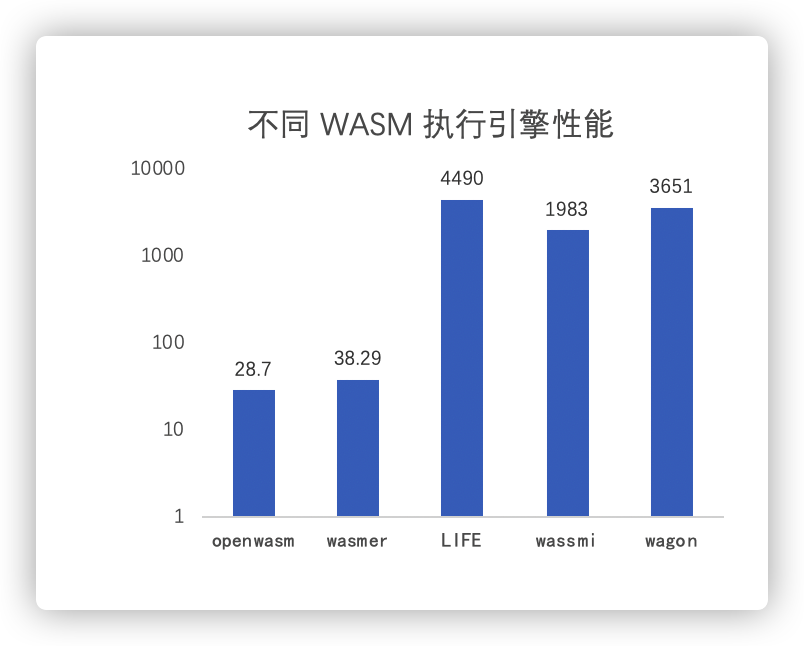

# OpenWASM

OpenWASM 是 [XuperChain](https://xuper.baidu.com/n/ps/opensource) 旗下的高性能 WebAssembly 虚拟机，采用 AOT 编译技术，支持资源审计与资源限制，原生支持 Golang 运行时

## 快速开始
### 构建
```shell script
    git clone https://github.com/oaow/openwasm.git
    cd xvm 
    make
    # 设置环境变量
    export PATH=`pwd`/bin:${PATH}
```

> 也可以将环境变量修改写入到 bashrc(bashprofile)，以便每次启动时新终端时自动设置环境变量


### 运行第一个WASM 程序

以 [add.wasm](example/testdata/add.wasm) 为例

```go
package main

import (
	"fmt"
	"io/ioutil"
	"log"
	"os"
	"path/filepath"
	"strings"

	"github.com/oaow/openwasm/compile"
	"github.com/oaow/openwasm/exec"
)

func compileLibrary(wasmpath string) (string, error) {
	tmpdir, err := ioutil.TempDir("", "xvm-exec-test")
	if err != nil {
		return "", err
	}
	defer os.RemoveAll(tmpdir)
	cfg := &compile.Config{
		Wasm2cPath: "wasm2c",
		OptLevel:   0,
	}
	libpath := replaceExt(wasmpath, ".so")
	err = compile.CompileNativeLibrary(cfg, libpath, wasmpath)
	if err != nil {
		return "", err
	}
	return libpath, nil
}

func replaceExt(name, ext string) string {
	dir, file := filepath.Split(name)
	idx := strings.Index(file, ".")
	if idx == -1 {
		file = file + ext
	} else {
		file = file[:idx] + ext
	}
	return filepath.Join(dir, file)
}

func main() {
	modulePath, err := compileLibrary("example/testdata/add.wasm")
	if err != nil {
		log.Fatal(err)
	}
	code, err := exec.NewAOTCode(modulePath, nil)
	if err != nil {
		log.Fatal(err)
	}
	ctx, err := code.NewContext(&exec.ContextConfig{GasLimit: exec.MaxGasLimit})
	if err != nil {
		log.Fatal(err)
	}
	defer ctx.Release()
	ret, err := ctx.Exec("_add", []int64{1, 2})

	if err != nil {
		log.Fatal(err)
	}
	fmt.Println(ret)
	// Output: 3
}
```


更多的例子可以在 [example](example) 目录里查看

## 性能基准
OpenWASM  针对非 Web 场景的高性能应用领域设计,采用预编译技术(AOT)提升运行时性能;采用代码缓存技术提升启动速度，降低运行时性能开销;采用基于控制流分析技术，降低资源审计开销。

采用snappy压缩算法，1K数据,1000000次迭代, 进基准测试，主流引擎执行时间如下图所示



OpenWASM 性能远优于 JIT 和解释执行模式的其他引擎，也优于其他预编译的执行引擎 
